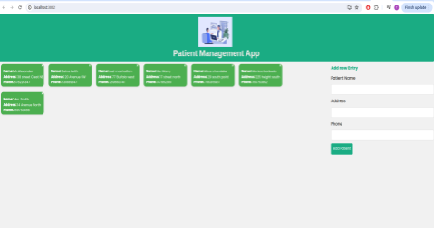

# Clinic_Patient_Management

---

## Overview

The **Patient Management App** efficiently manages patient information within a clinic. Key features include:

- **Add New Patients:** Easily enter new patient information.
- **Update Information:** Quickly update existing patient details.
- **Retrieve Information:** Seamlessly access patient data as needed.
- **Delete Information:** Safely remove patient records when necessary.

---

## Features

- **User-Friendly Interface:** Intuitive design for easy navigation.
- **Secure Data Management:** Ensures patient data is kept confidential and secure.
- **Efficient Information Retrieval:** Quick access to patient records.

---

## Installation

To install and run the Patient Management App, follow these steps:

1. Clone the repository:
    ```bash
    git clone "git@github.com:TaranaGit/Clinic_Patient_Management.git"
    ```
2. Navigate to the project directory:
    ```bash
    cd Clinic_Patient_Management
    ```
3. Install dependencies:
    ```bash
    npm install
    ```
4. Start the application:
    ```bash
    npm run dev 
    ```

---

## Usage

1. **Adding a New Patient:**
   - Go to the "Add Patient" section.
   - Fill in the patient's details.
   - Click "Submit" to save the information.

2. **Updating Patient Information:**
   - Search for the patient by name or ID.
   - Click "Edit" next to the patient's record.
   - Update the necessary information.
   - Click "Save" to apply the changes.

3. **Retrieving Patient Information:**
   - Use the search bar to find the patient.
   - View the patient's details on the result page.

4. **Deleting Patient Information:**
   - Search for the patient by name or ID.
   - Click "Delete" next to the patient's record.
   - Confirm the deletion.

---

## Technologies 

1. **Node.js**: A JavaScript runtime built on Chrome's V8 engine, Node.js allows for scalable and efficient server-side applications. It is crucial for handling asynchronous events and managing numerous concurrent connections in real-time.

2. **Express.js**: A minimal and flexible Node.js web application framework, Express.js provides robust features for building web and mobile applications. It simplifies the development process by offering a set of powerful tools and middleware for managing HTTP requests, routing, and sessions.

3. **React.js**: A popular JavaScript library for building user interfaces, React.js enables the creation of reusable UI components and efficient rendering of dynamic content. It is essential for developing a responsive and interactive front-end, ensuring a seamless user experience.

4. **MongoDB**: A NoSQL database that stores data in JSON-like documents, MongoDB offers high performance, scalability, and flexibility in data modeling. It is vital for managing and retrieving patient data efficiently, supporting complex queries, and ensuring data integrity.


---


## Structure

Patient Entry Form and a detailed display of patient's Info.


